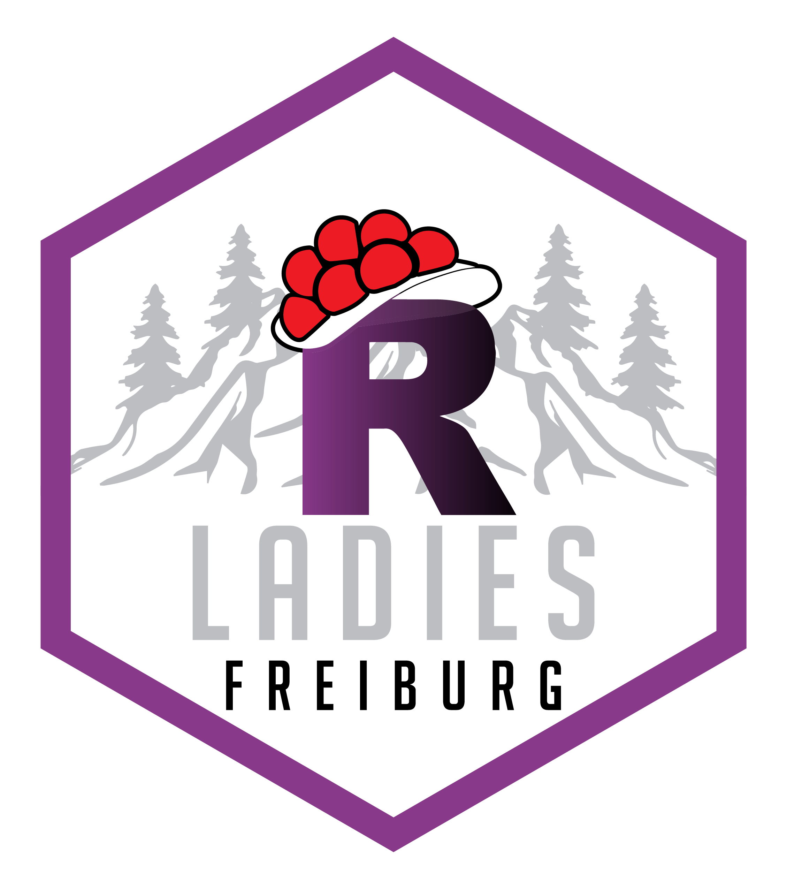
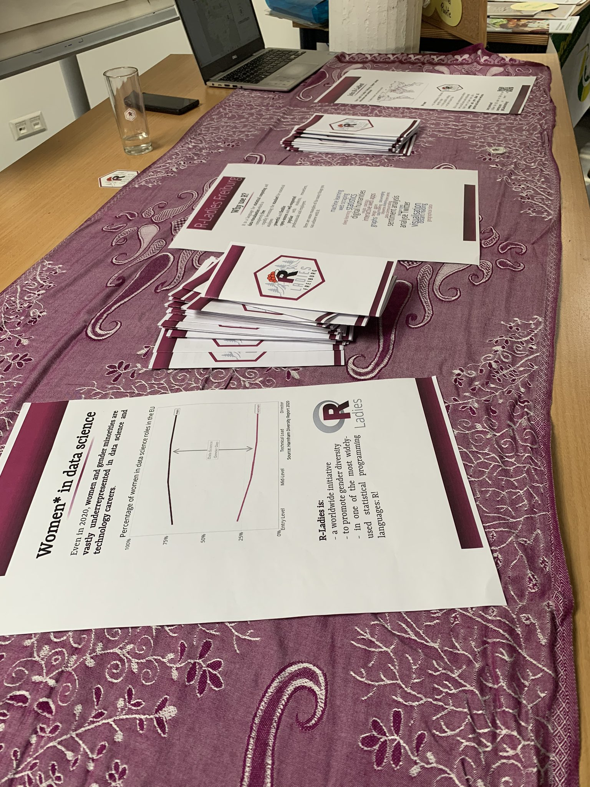

{width=250px}

R-Ladies is a worldwide initiative for women in statistics and programming. Since May 2020, I have been a co-organizer of the Freiburg branch, and I teach regular workshops for the group. Past topics I've taught include ["Text Processing with R"](https://www.meetup.com/rladies-freiburg/events/271449817/) and ["Sentiment Analysis with R"](https://www.meetup.com/rladies-freiburg/events/273638515/).

We generally meet twice monthly: on the first Wednesday of each month for a two-hour tutorial Meetup and on the Tuesday two weeks later to code Tidy Tuesday together. Starting in January 2021, I'll be designing and hosting a monthly beginner's session for new users.

To find out about our upcoming events, check us out on [Meetup](https://www.meetup.com/rladies-freiburg/) and follow us on [Twitter](https://twitter.com/RLadiesFreiburg). New members are always welcome!

Our meetings are also often recorded on Youtube.

{width=350px}

