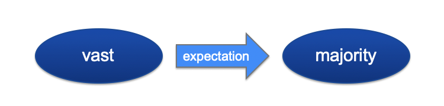

# Words that 'feel right' together

The following summary is based on the paper [Effects of task and corpus-derived association scores on the online processing of collocations](https://www.degruyter.com/view/j/cllt.ahead-of-print/cllt-2018-0030/cllt-2018-0030.xml). The paper and all research was done together with [Alice Blumenthal-Dramé](https://www.anglistik.uni-freiburg.de/seminar/mitarbeiter-und-sprechstunden/blumenthal). You can see the [poster version here](https://www.researchgate.net/profile/Kyla_Mcconnell2/publication/335991813_Can_corpus-derived_collocation_measures_reflect_expectations_in_language_processing/links/5d89d584458515cbd1be541c/Can-corpus-derived-collocation-measures-reflect-expectations-in-language-processing.pdf). What follows is a summary for all audiences.

## What's so interesting about 'vast majority'?
Have you ever noticed that some words "feel right" together? They just seem to fit or "belong" with one another. For example, we say "vast majority", not "mighty majority" or "colossal majority". 

There are huge collections of natural language, called corpora, that have millions of words collected from books, newspaper articles, and even television broadcasts. We can use these to calculate how often two words (like "vast" and "majority") are used together, compared to other alternatives.

We can also rank pairs and say that certain pairs are more strongly attracted to each other than others. In the field of corpus linguistics, many measures have been developed that calculate this "attraction". 

More and more research claims that speakers may be able to keep track of these sorts of statistics about patterns in language use. It may be a big part of how we understand language so effortlessly. For example, if you hear the word "vast", you may be able to anticipate "majority" -- if you then hear "majority", you can recognize it easier and faster. 

However, there are a couple of problems with the measures we have. First of all, they were never developed to tell us about the human mind -- they were developed to tell us about big collections of text samples. The texts included in corpora may not be the same as the language we hear everyday. Also, we read left to right, so words that we haven't seen yet can't affect our comprehension. The measures don't usually take this into consideration.

A parallel stream of research suggests that we might not have to think of the two words as separate things at all. It proposes that the mind doesn't work on the level of "words". Instead, the mind will "chunk" words together and see them as one unit, especially if they show up together a lot. This explains why we say "gonna" instead of "going to" -- it's become one chunk! Maybe the same thing happens in our mind for popular combinations of words.

So we started with two questions: 
1. Do language users keep track of statistical information, like how often two words are used together?
2. Do language users think on the level of "words" or do commonly used words tend to fuse into larger "chunks" in their minds?

## Testing these questions

If words are easier to understand, we tend to read them faster. For this reason, we can tell which words are easier to understand by recording how long it takes someone to read them. 

To easily collecting reading times for single words in context, we had participants read sentences one word at a time. Every time they pressed the spacebar, they could read the next word. 110 English native speakers participated and they each read 248 sentences.

We started sentences very neutrally so that readers couldn't guess what was coming up. Then we included the words 'vast majority' (and 91 other adjective-noun pairs of a similar type) and recorded the reading time to the second word. We wanted to see if reading a word like 'vast' then reading a strongly associated word like 'majority' would speed up reading of this word -- showing that it was easier to read.

## What we found

Using a statistical model, we removed the influence of word length (we read longer words slower, of course!) and frequency (we read uncommon words slower as well!). We also accounted for the fact that participants may respond differently; some might read faster than others, etc.

Then, we tested to see which measures were the best fit to the pattern of reading times. We were surprised to find that some were very unreliable, although they had are used in different research communities. 

However, two measures of the nine that we tested seemed to fit the data. Interestingly, one of these showed that the second word affects the first word, exactly in the opposite direction than what we assumed. This suggests that our understanding isn't as predictive as we thought, at least in this case. It may be that expectable words are easier to integrate into the unfolding message AFTER you've read them.

The second measure showed that the words are also accessed as one unit. So it seems like language comprehenders use multiple different strategies even at the same time!

(Coming soon -- full stats)

## But wait, there's more -- task effects

While participants read sentences, we had them answer questions to make sure they were reading carefully and understanding what they read. This is a standard part of this type of experiment. However, we thought that it might be interesting to see what effect this could have. So we tried two different types of questions. 

We found that having to answer typed questions seemed to lead to people reading more slowly. When people read slower, they seem to have access to statistical information in language for longer... it even lasts over the next couple words they read.

In this graph, you can see that the multiple choice section has overall faster reading times. Also, you see that more common chunks are read more quickly. However, the pattern is a little different in the two parts.

In the multiple-choice section, which is read faster, statistical information (like the commonness of chunks) has a big effect on the second word in the pair, but not on the following words. In the slower section, the typed section, the effect last longer.

We believe this if language is processed more quickly, the statistical information is lost more quickly, becuase the listener has to deal with all the incoming information. Thus, not only are multiple strategies at play, but speed seems to also have an effect.

## Recap
We asked the question of whether language users take note of statistics such as how often words are used together and if they use these to understand language more quickly and efficiently. We found that this does seem to be the case, though not in a predictive way but rather to assist integration after both words have been read. Further, we found support that commonly co-occuring words may be accessed as larger "chunks". So it seems that comprehenders use both stats at the word and at the chunk level at the same time. 

Additionally, we asked if a small task difference could change reading strategy. We found that it can have an effect -- specifically, tasks that cause faster reading may mean that statistical information about language is available for a shorter amount of time, compared to when reading slower. 

