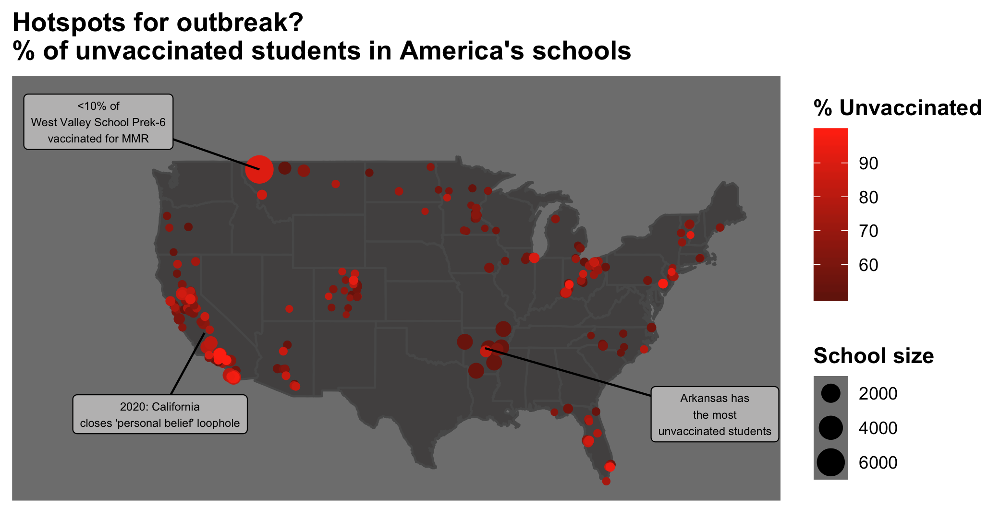

## TidyTuesday
TidyTuesday is an initiative from the [R for Data Science](https://r4ds.had.co.nz) community and focuses on data wrangling with the tidyverse and plotting with ggplot2. Datasets are posted every Tuesday on the [R for Data Science Github repository](https://github.com/rfordatascience/tidytuesday).

My past TidyTuesday results are on my [TidyTuesday Github repo](https://github.com/kyla-mcconnell/tidy-tuesday), and I post them weekly on my [Twitter](https://twitter.com/McconnellKyla).

A selected example deals with the level of vaccination in schools, from the February 26th, 2020 TidyTuesday.

{width=500px}

## Quantitative turn in linguistics
Coming soon

